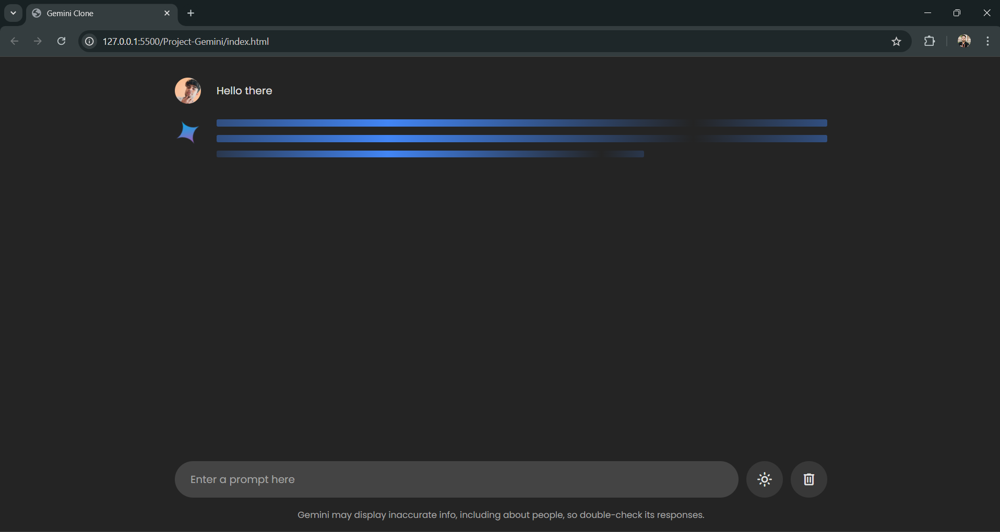

# 💬 Project Gemini – Google Gemini Chatbot

## 📘 Project Overview

Project Gemini is a modern, responsive chatbot built using HTML, CSS, and JavaScript. The chatbot is designed to simulate intelligent conversations, providing users with a sleek and interactive chat experience. It demonstrates key principles of conversational UI/UX and dynamic front-end web development.

---

## 🚀 Key Features

- 💬 Interactive chat interface  
- ⚡ Real-time responses  
- 📱 Responsive design compatible with all devices  
- ✨ Smooth UI/UX with transition animations  

---

## 🛠️ Technologies Used

- **Frontend:** HTML5, CSS3, JavaScript  
- **Libraries / APIs:** *(If any APIs are used, mention here)*  

---

## 🖼️ Screenshots

> Note: Please ensure your image is correctly linked relative to the project directory if sharing or deploying online.

---

## ✨ How to Use

1. Open the project in any modern browser.
2. Type a message in the chat window.
3. Interact with the chatbot and enjoy the conversational flow.

---

## 📌 Project Status

✅ **Completed** – Fully functional chatbot.  
💡 Open for future improvements and additional features.

---

## 🤝 Contributing

Pull requests are welcome!  
For major feature requests or improvements, please open an issue to discuss your idea before starting work.

---

## 📞 Contact

For feedback or inquiries, feel free to connect with me:

[🔗 LinkedIn – Deepak Shroff](https://www.linkedin.com/in/deepak-shroff-0b51792ba/)

---

> *Crafted with care using web technologies to create engaging user conversations.* 🌐✨
